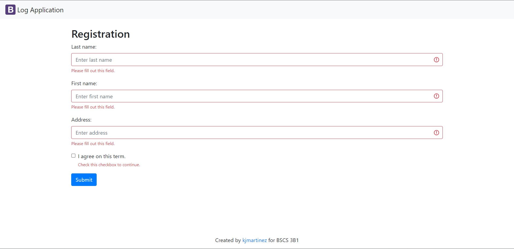
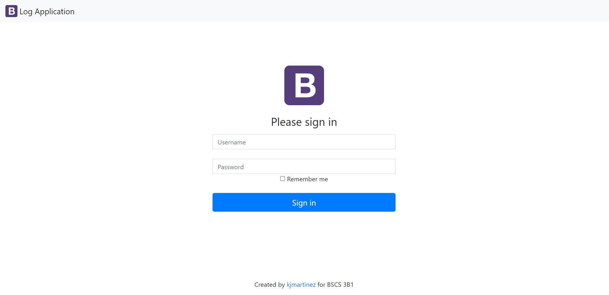
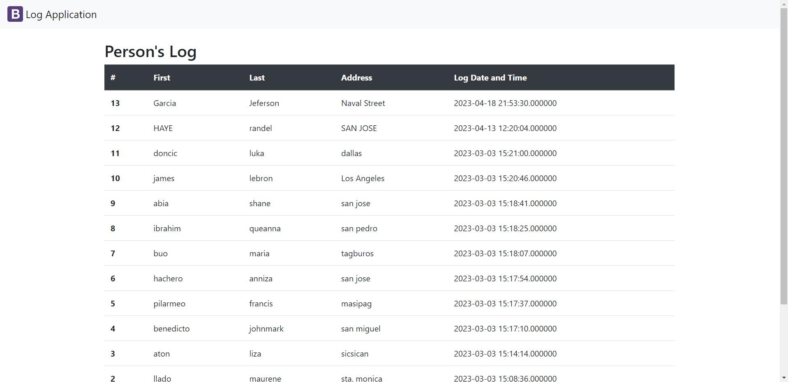

## Write a README file for your logApp project in logApp-scaling-octo repository. 

## Your README should have the following:
 

**1. Name :** LOG APP
 

**2. Description:**  The log App is a sample application that logs the individual's personal information and the date and time he/she visits the place. To protect an individual's personal information (RA 10173, Data Privacy Act of 2012), only users with an admin account can view the list of individuals who visited the premises.
 

**3. Visuals**
 

 

 

**4. Installation (preparation of database remotely using workbench or phpmyadmin)**

 

**5. Authors (include photos)** 
   
# Randel Vitero

  
# Liza May Aton

  
# John Mark Benedicto

